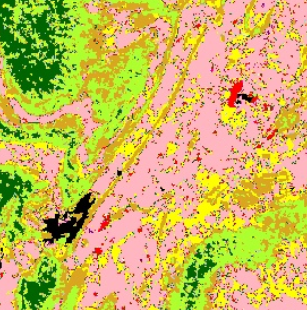

# Mapping landcover in India's Open Natural Ecosystems (ONEs)

This repo contains our code for mapping 7 major landcover types in India's Open Natural Ecosystems (ONE): ***saline areas***, ***sand dunes***, ***ravines***, ***sparsely vegetated areas***, ***open savannas***, ***shrub savannas*** and ***woodland savannas***. A visualization of this map is available [here](https://one-india.streamlit.app/).

This probabilistic land cover map was produced using an **explicit hierarchical classification** approach. See [below](#classificationtraining-and-prediction) for more on this approach.

> NOTE: This code base got us our current [map](https://one-india.streamlit.app/), and is being published here in the spirit of openness and transparency. Expect it to contain a few code chunks that are related to, but not directly involved in, producing this map. They were useful while we iterated through earlier versions of the map.

The building blocks of our approach, and how they have been organized into modules in our code, are depicted in the schematic below. The steps involved in our processing workflow are described below. More details about how the code and modules are organized are in the sections that follow.

![This figure shows a flowchart of our processing workflow. Our main inputs are landscape zonation information, historical satellite imagery and labeled points. The satellite imagery and landscape zonation information are used to produce and attach feature vectors to all the labeled points. A classifier is trained using this table of points with their feature vectors. Finally, the classifier is used to predict a resulting landcover map, which contains pixel-wise probability of each landcover type and the top-ranking landcover type label for that pixel.](schematic.png "Schematic of the processing workflow")

The rest of this document is arranged as follows:
* [Information about the output](#information-about-the-output)
  * [Description](#description)
  * [Bands](#bands)
* [Steps to reproduce our analysis](#steps-to-reproduce-our-analysis)
  * [1. Choose running parameters and inputs](#1-choose-running-parameters-and-inputs)
  * [2. Generate masks for landscape zonation and area of interest](#2-generate-masks-for-landscape-zonation-and-area-of-interest)
  * [3. Generate features, attach them & zonation variables to labeled points](#3-generate-features-attach-them--zonation-variables-to-labeled-points)
  * [4. Train a classifier and predict with it](#4-train-a-classifier-and-predict-with-it)
* [Additional module-level details](#additional-module-level-details)
  * [Generating zonations and area of interest](#generating-zonations-and-area-of-interest)
  * [Generating features and sampling them](#generating-features-and-sampling-them)
  * [Classification—training and prediction](#classificationtraining-and-prediction)
* [Funding and support](#funding-and-support)

## Information about the output
### Description

| | Description |
|:---------------------------|--|
|  | This dataset provides a probabilistic land cover classification for semi-arid India, covering 18 of its non-Himalayan states. It maps 7 different types of Open Natural Ecosystems and 5 classes of other land cover types.     **Earth Engine asset ID**: `ee.Image('projects/ee-open-natural-ecosystems/assets/publish/onesWith7Classes/landcover_hier')` [(link)](https://code.earthengine.google.com/?asset=projects/ee-open-natural-ecosystems/assets/publish/onesWith7Classes/landcover_hier) |

See [here](https://code.earthengine.google.co.in/02585ca79a284e0be81441c24f8653a7) for an Earth Engine sample script to get started.

### Bands

**Resolution**: 30 meters per pixel.

| Index| Name | Scaling | Min | Max | Description |
| :---------------------------|-|-|-|-|-|
| 0 | l1LabelNum | None | 100 | 200 | Numeric Code of Level 1 Label. 100: Non-ONE, 200: ONE.|
| 1 | l2LabelNum | None | 1 | 12 | Numeric Code of Level 2 Label. 1: agri_hiBiomass, 2: agri_loBiomass, 3: bare, 4: built, 5: dune, 6: forest, 7: ravine, 8: saline, 9: savanna_open, 10: savanna_shrub, 11: savanna_woodland, 12: water_wetland.|
| 2 | probL1Label | 10000 | 0 | 10000 | Probability Value of 'Winning' Level 1 Label. |
| 3 | probL2Label | 10000 | 0 | 10000 | Probability Value of 'Winning' Level 2 Label. |
| 4 | prob_nonone | 10000 | 0 | 10000 | Probability that a pixel is a Non-ONE. |
| 5 | prob_one | 10000 | 0 | 10000 | Probability that a pixel is an ONE. |
| 6 | prob_one_bare | 10000 | 0 | 10000 | Probability that a pixel is Bare or Sparsely-Vegetated. |
| 7 | prob_one_dune | 10000 | 0 | 10000 | Probability that a pixel is a Dune. |
| 8 | prob_one_ravine | 10000 | 0 | 10000 | Probability that a pixel is a Ravine. |
| 9 | prob_one_saline | 10000 | 0 | 10000 | Probability that a pixel is a Saline area. |
| 10 | prob_one_savanna_open | 10000 | 0 | 10000 | Probability that a pixel is an Open Savanna. |
| 11 | prob_one_savanna_shrub | 10000 | 0 | 10000 | Probability that a pixel is a Shrub Savanna. |
| 12 | prob_one_savanna_woodland | 10000 | 0 | 10000 | Probability that a pixel is a Woodland Savanna. |
| 13 | prob_nonone_agri_hiBiomass | 10000 | 0 | 10000 | Probability that a pixel is under 'high biomass' agriculture (e.g., orchards, groves, tree-crops, agroforestry). |
| 14 | prob_nonone_agri_loBiomass | 10000 | 0 | 10000 | Probability that a pixel is under 'low biomass' open agriculture (e.g., cereals, pulses, vegetables & oilseeds). |
| 15 | prob_nonone_built | 10000 | 0 | 10000 | Probability that a pixel is a built-up area. |
| 16 | prob_nonone_forest | 10000 | 0 | 10000 | Probability that a pixel is a forest. |
| 17 | prob_nonone_water_wetland | 10000 | 0 | 10000 | Probability that a pixel is a waterbody, or seasonal wetland. |

## Steps to reproduce our analysis

The map is generated by running 3 Python notebooks which call functions from 3 different modules, each of which require a variety of input parameters. The sections below pertain to these input parameters and notebooks, followed by [additional module-level details](#additional-module-level-details).

### 1. Choose running parameters and inputs
Config file: [`config.ini`](config.ini).

Values of nearly all running configuration and algorithm input parameters of the various code modules are stored as variables in the config file. They are read from this file at runtime. **Change their values in [`config.ini`](config.ini), before re-running the code.**

> An exception to this rule is the [classification](#classificationtraining-and-prediction) module. Here, a few key parameters determining the configuration of the final classification run can be specified as function arguments. See [`classifyHierarch.ipynb`](classifyHierarch.ipynb), for how to do so.

**When starting a fresh round of analysis:** create a new folder in your Earth Engine asset space, and set its path as the value of `assetFolderWithFeatures` in [`config.ini`](config.ini).

**When refreshing labeled points data for modeling:** [upload a points table](https://developers.google.com/earth-engine/guides/table_upload) (from, eg., a CSV or a Shapefile) into an Earth Engine Feature Collection, and set its path as the value of `lulcLabeledPoints` in [`config.ini`](config.ini). Ensure that the column with labels is named as `label_2024`. The table used in our analysis is at [`trainingData/trPts_2024.csv`](trainingData/trPts_2024.csv).

### 2. Generate masks for landscape zonation and area of interest

Python notebook: [`generateAOI.ipynb`](generateAOI.ipynb).

Module used: [`areaOfInterestMask`](areaOfInterestMask).

The [`generateAOI.ipynb`](generateAOI.ipynb) notebook uses the [`areaOfInterestMask`](areaOfInterestMask) module (see [here](#generating-zonations-and-area-of-interest) for additional module-level details) to take area-of-interest and biogeographic / geomorphological / geological classification information as inputs and produces corresponding mask rasters, in numeric- and one-hot-encoded formats.

All inputs and running parameters for this step are set in, and used from, [`config.ini`](config.ini).

### 3. Generate features, attach them & zonation variables to labeled points

Python notebook: [`calcFeatureRasterAndPoints.ipynb`](calcFeatureRasterAndPoints.ipynb).

Module used: [`featuresForModeling`](featuresForModeling).

The [`calcFeatureRasterAndPoints.ipynb`](calcFeatureRasterAndPoints.ipynb) notebook uses the [`featuresForModeling`](featuresForModeling) module (see [here](#generating-features-and-sampling-them) for additional module-level details) to take historical satellite imagery and various other gridded geospatial datasets and generates several features capturing the biophysical characteristics of landscapes at the pixel scale. It also uses [`labelHierarchy.json`](labelHierarchy.json) which contains a representation of the label hierarchy.

It then attaches these features and the zonation masks from the [previous step](#2-generate-masks-for-landscape-zonation-and-area-of-interest) to the labeled points, thus producing a table of labeled points with their corresponding feature vectors.

All inputs and running parameters for this step are set in, and used from, [`config.ini`](config.ini).

### 4. Train a classifier and predict with it

Python notebook: [`classifyHierarch.ipynb`](classifyHierarch.ipynb).

Module used: [`classification`](classification).

The [`classifyHierarch.ipynb`](classifyHierarch.ipynb) notebook uses the [`classification`](classification) module (see [here](#classificationtraining-and-prediction) for more on how it is organized) to train classifiers hierarchically using the table of feature-vector-attached labeled points. It then predicts with the herarchical classifiers to produce multiple intermediate probabilistic predictions. These intermediate predictions are then combined to produce a final map containing, for each hierarchical level, pixel-wise probability of each landcover type and the top-ranking landcover type label for that pixel.

Four ways of building hierarchical classification are considered here: 
* implicit
* dependent
* explicit
  * using ***multiplicative*** rule
  * using ***step-wise*** rule

After evaluations, the final map we published is the result of multiplicative explicit hierarchical classification approach. See [`classifyHierarch.ipynb`](classifyHierarch.ipynb) notebook for how to perform each of these classifications.

Many inputs and running parameters for this step are set in, and used from, [`config.ini`](config.ini). However, unlike in the previous steps, some of the key running parameters in this step are possible to be specified in-line in the notebook and passed as arguments into the training & prediction routine. These include:
* The type of classifier to use ([Random Forests](https://developers.google.com/earth-engine/apidocs/ee-classifier-smilerandomforest) / [Gradient Boosted Trees](https://developers.google.com/earth-engine/apidocs/ee-classifier-smilegradienttreeboost)).
* The set of features to use for training the classifier (and, hence, while predicting with it).
* The Earth Engine Asset folder to save the results in.

This programmatic flexibility allows for producing maps under different processing configurations (in parallel, even) relatively easily and reliably. Hence, it becomes possible to systematically and iteratively refine the classification towards better maps at-scale.

## Additional module-level details

The following are details about the modules, the code they contain, and how they are strung together into our processing workflow.

### Generating zonations and area of interest
  * [`areaOfInterestMask/semiarid.py`](areaOfInterestMask/semiarid.py): Produces 0/1 masks of zones based on states, biogeographic, geomorphological and geological zones, in both numeric and one-hot encoding modes, as well as a legacy mask for India's semi-arid zone used in a [previous work](https://onlinelibrary.wiley.com/doi/full/10.1111/jbi.14471). The following functions produce these masks based on Feature Collections that user needs to provide for states, biogeographic, geomorphological and geological zones.
    * `classificationZonesFromStatesNumeric()` and `classificationZonesFromStatesOneHotEncoded()`
    * `classificationZonesFromBiomesNumeric()` and `classificationZonesFromBiomesOneHotEncoded()`
    * `classificationZonesFromGeologicalAgeNumeric()` and `classificationZonesFromGeologicalAgeOneHotEncoded()`
    * `maskWithClassLabels()`

    Run these, from the notebook [`generateAoi.ipynb`](generateAoi.ipynb), to generate & store these rasters.

### Generating features and sampling them
  * [`featuresForModeling/generateFeatures.py`](featuresForModeling/generateFeatures.py): Uses satellite imagery and other gridded geospatial datasets to generate feature-rasters. Samples these feature rasters to attach labeled points with their features. The following functions produce the features and perform the sampling.
    * `seasonalityParamsL8()`
    * `tasseledCalCoeffsL8()`
    * `multiTemporalInterPercentileDifferencesL8()`
    * `palsarAggregation()`
    * ...
    * `geomorphologyTerrainRuggednessAggregation()`
    * `assembleFeatureBandsAndExport()`

    First, run the functions to generate the feature rasters individually. Once those are completed, run the function `assembleFeatureBandsAndExport()` to assemble them all into a composite raster and sample it to attach feature vectors to all the labeled points. Run all these functions from the notebook [`calcFeatureRasterAndPoints.ipynb`](calcFeatureRasterAndPoints.ipynb).

### Classification—training and prediction
  * [`classification/classifyAndAssess.py`](classification/classifyAndAssess.py): Performs training of hierarchical classifiers, predicts with each of them and then combines these predictions into a final land cover map and calculates the classification performance metrics.
    * `trainAndPredictHierarchical_master()`

    To run classification with different classifiers, choice of features to use, etc., define these as variables and pass them appropriately into `trainAndPredictHierarchical_master()` as arguments. Use [`classifyHierarch.ipynb`](classifyHierarch.ipynb) to see how to do this.

## Funding and support

Financial support for various aspects of this mapping work came from: 
* [The Habitats Trust](https://www.thehabitatstrust.org/)
* [National Centre for Biological Sciences](https://www.ncbs.res.in/), its [Archives](https://archives.ncbs.res.in/), [TNQ Technologies](https://www.tnq.co.in/csr-activities/)
* The Nadathur Foundation
* [Azim Premji University](https://azimpremjiuniversity.edu.in/) as part of the Research Funding Programme
* [ATREE](https://www.atree.org/)

Technical and logistical support came from: 
* [Nature Conservation Foundation](http://www.ncf-india.org/)
* [Mahesh Sankaran Lab](https://www.ncbs.res.in/faculty/mahesh)

Further, our work would not be possible without the creativity and generosity of efforts behind many free, public and open source scientific computation resources and software tools, chief among them being: 
* [geemap](https://geemap.org/) by  [Qiusheng Wu](https://github.com/giswqs)
* [Spatial Thoughts](https://spatialthoughts.com/) by [Ujaval Gandhi](https://github.com/spatialthoughts)
* [awesome-gee-community-catalog](https://gee-community-catalog.org/) by [Samapriya Roy](https://github.com/samapriya/)
* [Google Earth Engine Developers Group](https://groups.google.com/g/google-earth-engine-developers)
* [Google Earth Engine on Stack Exchange](https://gis.stackexchange.com/questions/tagged/google-earth-engine)
* [QGIS](https://qgis.org/)
* Yoni Gavish of [*Gavish et al. (2018)*](https://doi.org/10.1016/j.isprsjprs.2017.12.002)
* Multiple publicly-funded central and state government portals and repositories. 

These analyses were carried out on the [Google Earth Engine](https://earthengine.google.com/) cloud computing platform.
